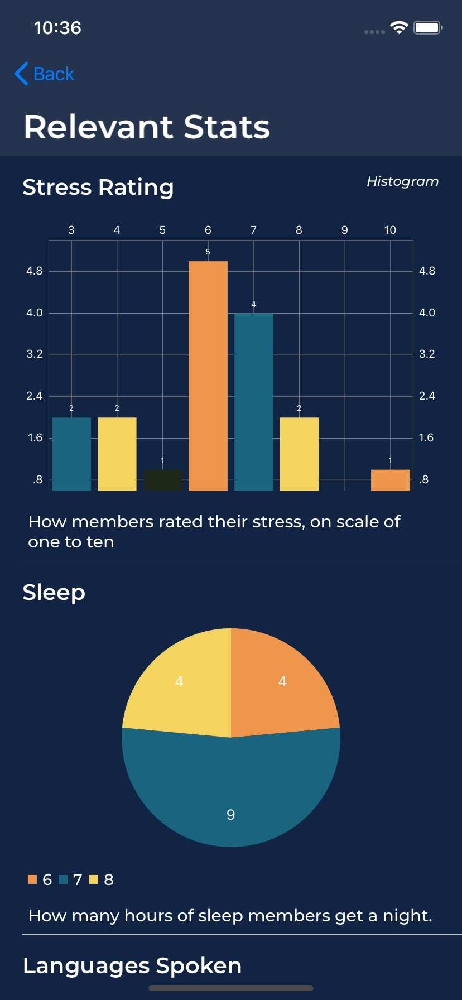

# DALI Social Network Challenge - Frontend

Written in [Swift](https://developer.apple.com/swift/) using [UIKit](https://developer.apple.com/documentation/uikit), [Alamofire](https://github.com/Alamofire/Alamofire), [Hero](https://github.com/HeroTransitions/Hero), [Kingfisher](https://github.com/onevcat/Kingfisher), and [Charts](https://github.com/danielgindi/Charts)!

**NOTE:** This app was originally designed for the iPhone Xr using a simulated device for testing. It has NOT been extensively tested on actual hardware, or on other iPhone models.

## Views

### Home

| Splash | Home |
| --- | --- |
|  |  |

[Members]() and [Statistics]() tiles for navigating.

### Members

| Members | Member Detail | Relevant Stats |
| --- | --- | --- |
|  |  |  |

**Members:** shows all members in the DALI lab, with key data points (name, role, year).  
**Member Detail:** shows more detailed information about each member including favorite quotes, majors, a map of their hometown, some auto-generated fun facts, and a link to relevant statistics.  
**Relevant Stats:** Statistics filtered by properties that overlap between anonymized and non-anonymized datasets. *NOTE: Due to the small size of the provided datasets, this page can reveal private information about members (some anonymized and non-anonymized datapoints can be directly matched).*

### Stats

| Stats | 
| --- |
| 

Unfiltered statistics about everyone in the DALI lab, conveyed through pie charts and histograms.
